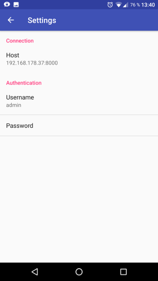

# Paperless Uploader

This is an android app to upload documents to your [Paperless](https://github.com/danielquinn/paperless) server. Just scan documents with an android pdf scanner app like [this one](https://play.google.com/store/apps/details?id=com.simplescan.scanner&hl=de) and share the documents with this app.

## Development Status
This project is under active development. Report any problems in the issues.

## Features
- Upload single or multiple PDFs to Paperless
- Shows number of documens and correspondents in Paperless
- Choose the correspondent of the PDFs to upload